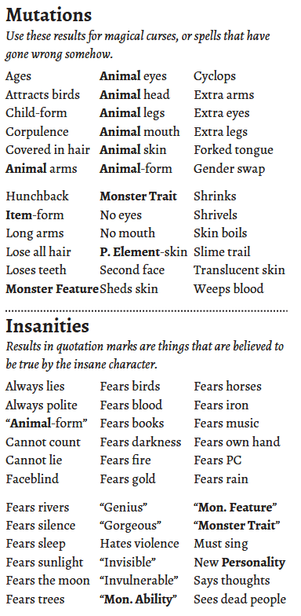

# Magic
The world  was spoken and written into existence. This language of this creation is the foundation of all magic. Spells are sentences in this language. They allow casters to bend the world around them to their will. 

Spells are not taught in a classroom. Those who know spells closely guard these secrets. Unleashing them upon the world could lead to catastrophe, intentional or not. Characters looking for spells will likely have to pry them off the corpses of dead sorcerers, or scour ancient libraries where they have been sequestered away. 

## Memory
Spells do not want to stay written down. Reading one directly off a page destroys it, as if correcting a universal wrong. To preserve spells you have found, they must be cast from your Memory.

As part of a watch spent resting, you can study your spells to gain Memory equal to 1d4+WIL. This replaces any previous Memory you had.

## Power
The power of a spell determines its strength, and the memory required to cast it. This is quantified with dice:
- 1 Power: 3d6
- 2 Power: 6d6
- 3 Power: 9d6

Power and Memory have a 1:1 relationship; using 1 Memory to cast a spell gives it 1 Power. You can spend extra Memory to cast a spell with higher Power. Some spells have a Power requirement and need at least that number of Memory spent in order to cast.

## Methods of Casting
A spell can be spoken, signed, or written. The method you use determines the range and targets that a spell can affect. 

**Spoken:** The caster speaks the language of creation out loud. They must be able to speak clearly. Range is determined by the volume of the caster’s voice. The sound of the spell must reach the target in order for it to take effect. Use the volumes and ranges below as a guide:
- Whisper - Close
- Talking - Nearby
- Shouting - Far
- Screaming - Distant

Spoken spells do not need to be listened to, the physical force of the sound just needs to reach the target. A thick wall or lead sheet can block a spoken spell, but plugging your ears will not help you.

**Signed:** The caster uses hand signs to convey the language of creation. Both hands must be free and mobile to do so. Range is limited to unobstructed targets up to Nearby. Picture straight lines flowing from the caster’s hands in all directions. Anything the lines touch is a valid target. Anything obstructed is not.

**Written:** The caster writes the spell on a surface using some implement (chalk, paint, ink, blood, etc.) Written spells target either the surface they’re written on, or the next thing to touch that object (the caster chooses when writing the spell). Touch targets must be Close to where the spell is written for the spell to activate. Written spells disappear from the surface immediately after they are cast.

Written spells use 1 Usage of material (chalk, ink, etc.) to write per zone affected. Spells written smaller than 1 zone do not use enough material to mark Usage for. 

## Casting a Spell
1. Choose the spell you want to cast, the method of casting, and the targets of the spell.
2. Choose how much Memory you want to dedicate to the spell.
3. Roll the number of dice according to its Power:
    - For every 6 rolled, roll an additional d6
    - For every 1 rolled, there is a Mishap
4. Add all the dice together. This total is referred to as [sum] in the spell’s description.
5. The spell goes off, the Referee describes the effects.

## Mishaps
- A Mishap occurs on a roll of 1 on any spell dice
- Consider this the caster stumbling over words, messing up hand signals, having a lapse in memory, etc.
- These very human errors have great consequences when exerting your will on the world
- The spell still goes off, but something goes wrong

Roll 2d6 on the Mishap table. The number of 1s rolled on your spell dice is referenced as [err]

|2d6|Mishap|
|---|------------------------------|
|2|You take [sum] damage as the spell rips through you. Any other effect the spell has is centered on you.|
|3|The spell mutates your body. Roll for a random mutation or come up with something related to the spell.|
|4|The will of creation exerts back on you. You take 1d6 + [err] wounds.|
|5|You are in **Agony** for [err] rounds.|
|6|The spell requires great effort to control. You take 1d6 + [err] damage.|
|7|The spell requires more focus to enact, you lose [err] memory.|
|8|A wave of **Fear** washes over you for [err] rounds.|
|9|Your mind is **Befuddled** for [err] rounds.|
|10|The spell eats away at your equipment. Mark 1d6 + [err] Usage on items in your inventory.|
|11|Your mind is broken by the strain of the spell. Roll for a random insanity, or come up with something related to the spell.|
|12|The spell scrambles your memory. You lose [sum] memory immediately. [sum] is also a penalty to the memory you gain from a watch of rest. The penalty is reduced by 1 every watch of rest you take. While reduced to 0 or lower, you suffer amnesia.|

### Mutations and Insanities
for the tables below, roll 2d6. The first d6 determines the block, the second d6 determines the line in that block. 

tables from Maze Rats by Ben Milton